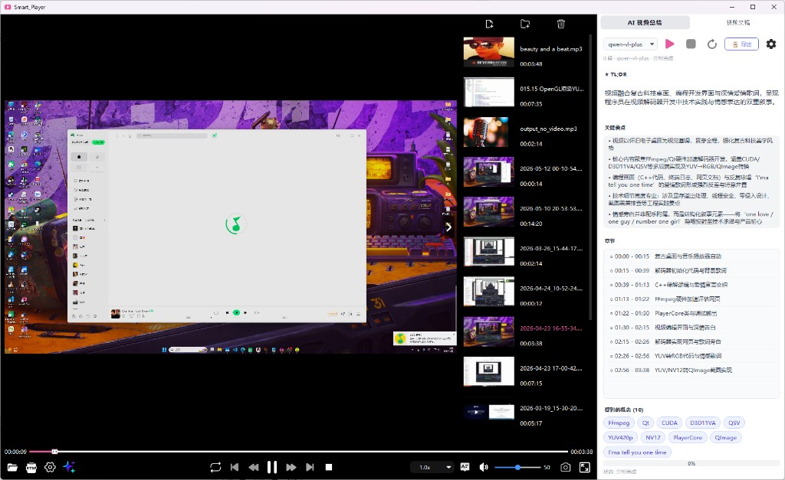

# Smart_Player

> 基于 **Qt 6.9 + FFmpeg + whisper.cpp** 的本地视频播放器，集成 AI 字幕、AI 语义分段、AI 总结 / 文稿跟随 等特性。
>
> 当前构建系统：**CMake**（`Smart_Player.pro` 仅作历史参考保留）。

## 项目截图



---

## 1. 项目概览

| 项 | 说明 |
|----|------|
| 语言 / 标准 | C++17 |
| UI 框架 | Qt 6.9（Core / Gui / Widgets / OpenGL / Multimedia / Network / Svg / Concurrent） |
| 多媒体栈 | FFmpeg（avformat / avcodec / swscale / swresample / avfilter）+ SDL2 |
| ASR | whisper.cpp（自带 ggml-base / ggml-cpu） |
| 架构 | MVVM（View / ViewModel / Model 三层，重构完成） |
| 平台 | Windows 10+，MinGW / MSVC |

---

## 2. 目录结构

```
Smart_Player/
├── CMakeLists.txt              # ★ 主构建脚本（CMake）
├── Smart_Player.pro            # 历史 qmake 工程，仅作参考
├── main.cpp                    # 程序入口
│
├── src/                       # 源码目录（所有业务代码）
│   ├── app/                    # View 层：QWidget 派生类、UI 控件、弹窗、配置 UI
│   ├── core/                   # 播放核心
│   ├── viewmodel/              # MVVM - ViewModel 层
│   ├── summary/                # AI 总结 / 文稿
│   ├── subtitle/               # ASR 字幕
│   ├── queue/                  # AV 帧 / 包队列
│   ├── render/                 # 渲染
│   ├── resampler/              # 重采样
│   ├── demuxer/               # 解封装
│   ├── decoder/                # 解码
│   ├── filter/                 # 滤镜
│   ├── converter/              # 视频转换（截图 / 缩略图）
│   ├── pool/                  # AVFrame / AVPacket 对象池
│   └── utils/                  # 通用工具
│
├── dependencies/               # 第三方依赖（本地副本）
│   ├── include/                # 头文件（FFmpeg / SDL2 / whisper / nlohmann / half_float）
│   ├── lib/                    # 导入库 .lib / .a
│   ├── bin/                    # 运行时 DLL（链接时复制到 exe 同级）
│   ├── models/                 # whisper ggml 模型文件
│   └── plugins/                # Qt 插件（platforms / imageformats / iconengines）
│
├── cmake/                      # CMake Find 模块
│   └── FindWhisper.cmake       # 自定义 whisper 查找器（处理 MinGW 导入库）
│
├── resources/                  # 应用资源
│   ├── Resource.qrc            # Qt 资源文件（图标 / gif）
│   ├── app_icon.rc             # Windows 资源：EXE 图标
│   ├── logo.ico                # 应用图标
│   └── SmartPlayer-icon/       # 图标图片（按钮 / 状态 / 加载动画）
│
├── scripts/                    # 构建 / 维护脚本
│   ├── build.bat               # 一键 CMake 构建（MinGW / Qt 6.9.0）
│   └── clean.bat               # 清理 build-cmake
│
├── docs/                       # 设计文档 / 分析报告
│   ├── MVVM_REFACTOR_PLAN.md
│   ├── 文稿面板设计方案.md
│   ├── 内存安全分析报告.md
│   └── screenshots/             # README 中引用的界面截图
│
├── build-cmake/                # ★ CMake 构建产物（.gitignore，不会入库）
│
├── .gitignore
└── .agents/                    # Agent skills（本地）
```

---

## 3. 构建方式

### 3.1 一键脚本（推荐）

```bat
:: 项目根目录下
scripts\build.bat
```

等价于：

```bat
cmake -G "MinGW Makefiles" ^
    -DCMAKE_BUILD_TYPE=Release ^
    -DCMAKE_CXX_COMPILER=D:/Qt/Tools/mingw1310_64/bin/g++.exe ^
    -DCMAKE_MAKE_PROGRAM=D:/Qt/Tools/mingw1310_64/bin/mingw32-make.exe ^
    -DQt6_DIR=C:/Qt/6.9.0/mingw_64/lib/cmake/Qt6 ^
    .
cd build-cmake
cmake --build . --parallel
```

输出：`build-cmake\Smart_Player.exe`

清理：

```bat
scripts\clean.bat
```

### 3.2 IDE

- **Qt Creator**：直接打开根目录的 `CMakeLists.txt`，选择构建套件即可。
- **CLion / VSCode**：配置 CMake 工具链指向 `D:/Qt/Tools/mingw1310_64/bin/g++.exe`，构建目录设为 `build-cmake/`。

### 3.3 qmake（不推荐，仅历史参考）

`Smart_Player.pro` 仍保留可用，但不再主动维护：

```bat
qmake Smart_Player.pro
mingw32-make
```

---

## 4. 第三方依赖说明

| 库 | 路径 | 用途 |
|----|------|------|
| FFmpeg | `dependencies/{include,lib,bin}/` | 解封装 / 解码 / 滤镜 / 重采样 |
| SDL2 | 同上 | 音频回调 |
| whisper.cpp + ggml | 同上 | ASR（ggml-base / ggml-cpu） |
| Qt 6.9.0 | `D:/Qt/6.9.0/mingw_64/` | 框架 |
| MinGW 13.1.0 | `D:/Qt/Tools/mingw1310_64/` | 工具链 |

CMake 会自动：
1. `add_custom_command(POST_BUILD)` 把 `dependencies/bin/*.dll` 复制到 exe 同级目录；
2. 把 `dependencies/plugins/*.dll` 复制到 exe 同级的 `platforms/`、`imageformats/`、`iconengines/`；
3. 从 `D:/Qt/6.9.0/mingw_64/plugins/tls/` 复制 `tls/` 插件（HTTPS 支持）。
4. `main.cpp` 启动时调用 `QCoreApplication::addLibraryPath()` 注册插件路径，并设置 `QT_TLS_BACKEND=schannel`（无需 OpenSSL DLL）。

---

## 5. 本次更新摘要

> **本节对应工作区未提交改动**（2026-06-28，`refactor/cmake-mvvm` 分支），主题为 **Windows 全屏修复 + UI 主题重做 + 一批状态/线程 bug 修复**，未触及 MVVM 三层结构。

### 5.1 概览

```
 32 files changed, 1423 insertions(+), 930 deletions(-)
未跟踪新增：resources/SmartPlayer-icon/*.png  x6、tools/make_check_icon.py
```

净增 493 行 —— 主要是 `settingdialog.ui` 重排 + `summarysettingsdialog.cpp` 大段样式表新增。

### 5.2 重点改动

#### 5.2.1 Windows + OpenGL 全屏 bug 修复（核心）

`videoWidget` 是 `QOpenGLWidget`，主窗口进入 `showFullScreen()` 后整个 `QMainWindow` 都会成为 OpenGL surface；Windows DWM 因此拒绝把 popup 类顶层窗口（QComboBox 下拉、Qt::Popup 弹窗、菜单、SubtitlePopup）合成到主窗口之上 —— 全屏下点倍速 combobox 不弹、AI 字幕 SubtitlePopup 不显示。

修复方式（按官方建议，给全屏 HWND 加 `WS_BORDER`）：

- `main.cpp`：窗口 `show()` 之后立即调用 `QNativeInterface::Private::QWindowsWindow::setHasBorderInFullScreen(true)`，标记存入 `QWindow`。
- `mainwindow.cpp::event()`：监听 `QEvent::WinIdChange`，拿到 HWND 后 `SetWindowLongPtr(..., GWL_STYLE, ... | WS_BORDER)`，让 DWM 走完整合成路径。
- `CMakeLists.txt` / `Smart_Player.pro`：增加 `Qt6::GuiPrivate`（`gui-private`）链接，仅 `WIN32` 下生效。

#### 5.2.2 UI 主题重做

三个对话框 / 面板分别走三套浅色风格：

| 界面 | 风格 | 主色 |
|------|------|------|
| `SettingDialog` | 玫红/粉色 + QGroupBox 分组 | `#DB2777` / `#F472B6` / `#EC4899` |
| `SummarySettingsDialog` | 紫色 + QGroupBox 分组 | `#6366F1` / `#8B5CF6` |
| `SummaryPanel` / `TranscriptPanel` | 原有浅色 + 新增暗色细滚动条 + QCheckBox 自定义 indicator | `#9CA3AF` |

`settingdialog.ui` 全部按"加速与解码 / 画面调节 / 画面尺寸 / 路径设置"四组重构，旧 QHBoxLayout 全拆为 QGroupBox + Form 风格，窗口从 350×500 改成 460×620（最大 520×800）。控件统一加 `cursor: PointingHandCursor` 与全局 QSS（QPushButton 渐变 / QLineEdit focus 玫红描边 / QComboBox 自绘下拉箭头 / QScrollBar 8px 暗色细条）。

新增图标资源（`tools/make_check_icon.py` 用 PIL 生成 + 4 个箭头 PNG）：

- `arrow_{up,down}_{grey,light}.png`
- `check_white.png` / `check_skyblue.png`

`Resource.qrc` 同步追加上述 6 个条目。`mainwindow.ui` 把原来指向 `../resources/Resource.qrc` 的 21 处 iconset 全部改成 `../../resources/Resource.qrc`，与 ui 文件位于 `src/app/`、资源位于 `resources/` 的相对路径匹配。

`SubtitlePopup` / `VideoItemWidget` 等若干 UI 类同步做小调整：长文件名加 `QFontMetrics::elidedText` + tooltip 全名、SubtitlePopup 移除装饰性注释、ComboBox 下拉箭头替换为图标。

#### 5.2.3 状态/线程类 bug 修复

| 文件 | 问题 | 修复 |
|------|------|------|
| `mainwindow.cpp` `onSliderClicked` / `on_progressSlider_sliderReleased` | `int value * 1000000` 溢出（>33 分钟变负） | 显式 `qint64(value) * 1000000` |
| `playerviewmodel.cpp` `setVolume` / `setMute` / `setSpeed` | 旧实现 `if (v == m_volume) return;` 会短路 —— 切视频后 `audio_output_` 是新建对象，默认 50/未静音/1.0 倍速，若 VM 缓存的状态相同就跳过推 core，导致新视频停留在错误状态 | 改为**无条件**把当前 UI 状态推给 core，再 emit 变更信号 |
| `audiooutput.cpp` `resampleFrameToBuffer` | `audio_clock_us_ =` 处加锁后又立即解锁，与下一句 `sync_clock_->set_audio_clock()` 解耦 | 注释掉那段多余的 `QMutexLocker`（`audio_clock_us_` 已在 SDL 回调内自洽，无需再加锁） |
| `mainwindow.cpp::eventFilter` | 全屏下打开/关闭文件列表、显隐右侧 dock 后 `controlBarContainer` 宽度不同步 | 给 `fileList` / `playerPage` / `m_rightDock` 安装 eventFilter，监听 `Resize/Show/Hide`，用 `QTimer::singleShot(0)` 推迟到事件循环下一轮再 `repositionControlBarFullScreen()` |
| `videoitemwidget.cpp/.h` | 长文件名截断后无法看到完整路径 | 缓存 `m_fullFileName`，`resizeEvent` 调用 `QFontMetrics::elidedText`，item 整体与 label 都设置 `setToolTip(m_fullFileName)` |

#### 5.2.4 代码清理

- `playercore.cpp` / `audiooutput.cpp` / `openglrenderer.cpp`：删除大量噪声 `qDebug()` 与"复制粘贴式"段落注释（`// 解码` / `// Y纹理` / `// 音量调节` 等），行为不变。
- `subtitlepopup.cpp` / `videoconverter.cpp` / `videoslider.cpp`：删除冗余注释。
- `videoslider.h`：去掉无意义的 `/** 点击事件 */` 注释。

### 5.3 兼容性 / 风险点

| 风险 | 缓解 |
|------|------|
| `Qt6::GuiPrivate` 是 Qt 私有接口，未来 Qt 升级可能改名 | 集中在 `main.cpp` 一处使用 + CMake / qmake 都加 `WIN32` 守卫；改名时只影响这一个调用点 |
| `WinIdChange` 每次拿到 HWND 都改一次 style | `SetWindowLongPtr` 是幂等的，`WS_BORDER` 已存在时再 OR 一次无副作用 |
| `playerviewmodel.cpp` 不再短路后，setVolume 每次都走 core 链路 | core 内部 `setVolume` 是 setter，开销可忽略 |
| `settingdialog.ui` 控件名保持兼容 | 所有老 widget objectName（`softwareRadio` / `hardwareRadio` / `decodeCombox` / `lightSlider` / `contrastSlider` / `baoheSlider` / `defaultSize` / `expandSize` / `saveFilePath` / `selectPathBtn` / `modelPathLineEdit` / `uploadModelPathBtn` / `resetConfigBtn` / `confirmBtn` / `cancelBtn`）未改名，dialog 业务代码无需调整 |

### 5.4 验证

本次未提交改动未在本机跑 `cmake --build`，若需验证建议：

```bat
scripts\build.bat
build-cmake\Smart_Player.exe
```

检查项：① 全屏时点击倍速 combobox 是否正常弹出；② 全屏时点击 AI 字幕按钮 SubtitlePopup 是否正常显示；③ 切到下一个视频时音量/倍速/静音是否与 UI 一致；④ 滚动播放列表长文件名是否省略显示 + 悬浮可见全名；⑤ 设置对话框三个 QGroupBox 是否正确分组。

---

## 6. 已知遗留 / TODO

| 项 | 状态 |
|----|------|
| MVVM 阶段 3-5（`SummaryViewModel` / `SettingsViewModel` / `TranscriptViewModel`） | 已完成 |
| `内存安全分析报告.md` 中 High 18 个问题 | 部分修复中（`AudioOutput` 竞态已解） |
| `Smart_Player.pro` 是否彻底下线 | 待决定（当前保留以备回滚） |

---

## 7. 变更日志

| 日期 | 提交 | 说明 |
|------|------|------|
| 2026-06-28 | （未提交） | Windows 全屏修复（QWindowsWindow + WS_BORDER）；SettingDialog / SummarySettingsDialog / SummaryPanel 主题重做；seek 溢出与切视频音量/倍速 bug 修复；新增 tools/make_check_icon.py + 6 个图标资源；README 顶部增补项目展示图 |
| 2026-06-27 | `a8f39c7` | 合并 MVVM 阶段 3-5 + 内存泄漏修复；新增 Settings/Summary/Transcript 三个 ViewModel |
| 2026-06-27 | `4e93594` | 迁移到 CMake 并重构目录结构（qmake→CMake，源码统一放 `src/`） |
