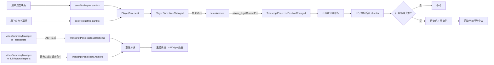
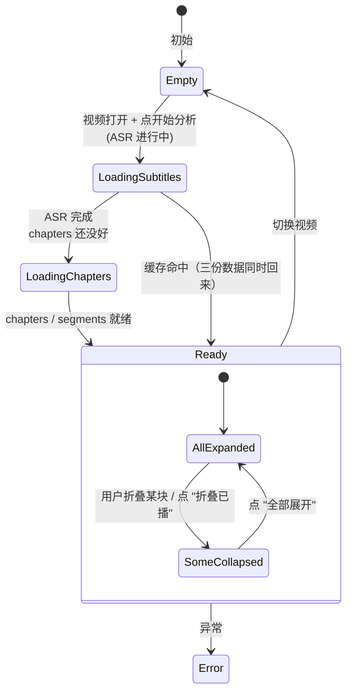

# 视频文稿面板设计方案 v3（语义分段 + K 歌逐字变蓝）

> 与 AI 总结看板**并列**的右侧 Dock。**按 AI 解读的章节（chapters）分块**，每块内聚合同一段的所有字幕逐句显示。
> **逐句**：已播放 → **天蓝色**，未到 → **黑色**，当前句 → **深蓝加粗 + 左侧色条**。
> **逐字（v3 新增）**：当前句内部**字/词级 K 歌式渐变变蓝**——已读字天蓝、当前字深蓝高亮、未读字黑色。
>
> 决策日期：2026-06-14（v2：按用户要求改用 chapters 分块；v3：追加逐字变蓝）
>
> 状态：**已确认，待实施**

---

## 〇、v2/v3 相对 v1 的关键变化

| 维度 | v1（旧） | **v2** | **v3（最新）** |
|------|---------|--------|----------------|
| 顶层结构 | 1500 条 `SubtitleItem` 平铺 | **按 `SummaryReport.chapters` 分块** | 同 v2 |
| 每块内容 | 一条字幕 = 一行 | **一段语义章节 = 一个卡片块 + 块内多条字幕行** | 同 v2 |
| 块标题 | 无 | **AI 生成的章节标题**（如 "OpenGL 多线程限制与 YUV 缓冲区管理"）+ 时间范围 | 同 v2 |
| **逐句染色** | 单条字幕粒度 | **行级**（黑/天蓝/深蓝加粗+色条） | 同 v2 |
| **逐字染色** | — | — | **🆕 当前句字/词级 K 歌渐变变蓝**（线性插值，中英文智能分词） |
| 折叠 | 无 | **块头点击折叠/展开** | 同 v2 |
| 数据源 | 仅 `m_asrResults` | `m_asrResults` **+** `m_fullReport.chapters` | 同 v2 |
| 与看板的"章节列表" | 完全独立 | **共享同一份 chapters**，与 `SummaryPanel.m_segmentList` 数据同源 | 同 v2 |

---

## 一、决策汇总

| 决策项 | 选定方案 | 理由 |
|--------|---------|------|
| 顶层结构 | **QListWidget 两级条目**：块头（不可点选）+ 块内字幕行 | 简单可控，QListWidget 原生支持不同行高；不用 QTreeView 是因为不要严格父子树 |
| 块头数据 | `SummaryReport.chapters`（AI 解读后的章节） | 已有"用户视角"标题，比 `segments` 友好 |
| 块内字幕 | 该 chapter 范围内**所有 `SubtitleItem`** | 与看板共享一致 |
| **逐句染色粒度** | **行级**（每条字幕），非块级 | 跟读时逐句变蓝，块级太粗 |
| **逐字染色粒度（v3）** | **字/词级 K 歌渐变**，仅当前句精细化 | 当前句之外的句仍走"整句染色"，性能可控 |
| **逐字时间戳来源（v3）** | **线性插值**：把每句 `start_sec~end_sec` 均分给每个字/词 | 不改 ASR 数据源，0 后端成本；跟读观感够用 |
| **分词策略（v3）** | **智能分词**：中文按"字"、英文按"词"（空格分）、中日韩标点单独成段 | 中英混排时不变蓝卡在标点上 |
| **行高（v3 变化）** | **非当前行 28px，当前行 36px**（预留两行高度以容错混排） | 当前行字多时不被截断 |
| 块头折叠 | 默认**全部展开**，已播完的块可一键"折叠已播" | 跟读时屏幕只留当前块+上下文 |
| 折叠状态持久化 | 不需要 | 重启后默认展开 |
| 染色滚动目标 | 滚动到当前字幕行，**而非块头** | 跟读的是行 |
| chapters 为空 | **降级为 segments 分块**（仍分块，但用 segments.startMs/endMs，块标题 = "第 N 段"） | 不允许退化成"无分块" |
| 降级后无 segments | 降级为"无块"，但顶部加一个标题 "(本视频暂未生成 AI 解读，纯字幕流)" | 至少告知用户 |
| 章节标题不可用 | chapters[i].title 为空时，块头显示 `"[00:00 - 01:00]  段 N"` | 兜底 |
| 自动滚动 | 当前行高亮时**滚动到视区中央** | 跟读体验 |
| 折叠粒度 | 单块折叠（"v"图标）+ 工具栏按钮"全部折叠/展开" | 双层控制 |
| **逐字总开关（v3）** | 工具栏加"逐字变蓝"复选框，**默认开启**，用户可关 | 关掉时退回到 v2 的"整句染色" |

---

## 二、用户故事（重写）

> 我打开侧边文稿面板后，看到的不再是密密麻麻的字幕流，而是**一节一节的卡片**：
>
> - 第一节标题是"OpenGL 头文件引入"，下面挂着 8 条字幕
> - 第二节是"MacOS 多线程限制"，下面挂着 12 条字幕
> - 视频播到第 1 节最后一条时，第 1 节整块**变淡蓝**（已播完标记）
> - 视频播到第 2 节中间某一句时，这一句**深蓝加粗 + 左侧色条**，它前面所有字幕**天蓝色**，后面**黑色**
> - 我点击第 3 节的块头 → **视频跳到第 3 节开头**
> - 我点击第 1 节的 [v] 折叠按钮 → 第 1 节折叠成一行块头 → 屏幕留出空间看当前节
> - 工具栏的"折叠已播"按钮一键折叠所有已播完的块
> - 搜索"Qt" → 包含"Qt"的行**变黄底**，自动跳到第一个命中

---

## 三、UI 布局

### 3.1 整体布局

```plain
┌────────────────────────────────────────────────────┐
│ 视频文稿                                       [×] │ ← QDockWidget 标题
├────────────────────────────────────────────────────┤
│ 🔍 [搜索关键词______________]  [折叠已播] [≡展开]   │ ← 工具栏
├────────────────────────────────────────────────────┤
│                                                    │
│  ▶ [00:00 - 01:00] OpenGL 头文件引入与 this 指针... │ ← 块头（可点击跳转）
│      00:01  大家好，今天我们来聊 Qt 跨平台...      │ ← 块内字幕行
│      00:05  在 Qt 框架下面有一个 OpenGL 头文件...   │
│      00:09  这个 widget 继承自 QOpenGLWidget...     │
│      00:13  ▶ this 指针作为父窗口传入...           │ ← 当前行
│  ▼ [01:00 - 02:11] setCentralWidget 与 CenterEdit  │
│      00:17  然后我们看到 setCentralWidget...       │ ← 已播：天蓝
│      00:22  这里有一个 CenterEdit 初始化...        │
│      00:26  主要作用是占位...                       │
│      ...                                            │
│  ▶ [02:11 - 02:37] RenderVideo 函数与 YUV 渲染流程  │ ← 未播：黑
│      00:31  接下来我们看 RenderVideo 函数...        │
│      ...                                            │
│  ▶ [04:18 - 04:25] update() 触发重绘机制            │
│      ...                                            │
│                                                    │
└────────────────────────────────────────────────────┘
```

### 3.2 视觉规范

| 元素 | 颜色 / 样式 | 备注 |
|------|------------|------|
| 块头背景 | `#F9FAFB` | 浅灰底，区别于字幕行 |
| 块头未播 | 文字 `#1F2937` | 默认深灰/近黑 |
| 块头已播完 | 文字 `#94A3B8`（淡蓝灰）+ 半透明 | 整块变淡，提示"已读完" |
| 块头当前块 | 文字 `#0C4A6E`（深蓝）+ 左侧 3px `#0EA5E9` 色条 | 当前正在播放的块 |
| 块头点击 | 跳转播放到该块 `startMs` | 整块可点 |
| 块头折叠按钮 | `[▶]` 展开 / `[▼]` 折叠 | 右侧小图标 |
| 字幕行未播 | `#1F2937` | 14px |
| 字幕行已播 | `#0EA5E9`（天蓝） | 14px |
| 字幕行当前 | `#0C4A6E`（深蓝）**加粗** + 背景 `#F0F9FF` + 左侧 3px `#0EA5E9` 色条 | 唯一视觉强调 |
| 块间分隔 | 6px 空白 | 不要横线 |
| 块内字幕行间距 | 2px | 紧凑 |
| 搜索命中 | 背景 `#FEF3C7`（淡黄） | 优先级最高 |
| 时间戳 | `#6B7280` 11px monospace | 固定宽度对齐 |

### 3.3 块头的左侧小图标

- `▶` 三角形播放图标：未播完（默认）
- `▼` 倒三角：折叠中
- `⏸` 暂停图标（可选）：当前块且正在播放的位置
- `✓` 勾：已播完（仅作美化，主色调已变）

---

## 四、整体架构

### 4.1 模块划分

```plain
新增模块（2个文件）
├── transcriptpanel.h/.cpp    ← 核心：两层级 QListWidget + 染色 + 折叠 + 跳转

改动现有文件（5处）
├── mainwindow.h/.cpp         ← setupTranscriptPanel() + splitDockWidgets
├── videosummarymanager.h     ← 公开 chapters / segments / asrResults 访问
├── summarypanel.h/.cpp       ← populateFromReport 末尾通知 TranscriptPanel
├── AI智能语义分段设计方案.md  ← 引用本文档作为"看板章节列表 = 文稿分块"的设计依据
└── Smart_Player.pro          ← 添加新文件
```

### 4.2 整体流程图



---

## 五、数据结构

### 5.1 复用现有结构（不新建）

```cpp
// 已有
struct SummaryChapter { qint64 startMs, endMs; QString title; };
struct SubtitleItem    { double start_sec, end_sec; std::string text; };
struct SummarySegment  { int index; qint64 startMs, endMs; QString speechText; ... };
```

### 5.2 新增（仅 TranscriptPanel 内部）

```cpp
// transcriptpanel.h —— 私有类型

// 一行条目类型
enum RowType {
    Row_ChapterHeader,  // 块头
    Row_Subtitle        // 字幕行
};

struct RowItem {
    RowType type;
    int chapterIndex = -1;       // 属于哪一块
    int subtitleIndex = -1;      // -1 表示块头
    qint64 startMs = 0;
    qint64 endMs = 0;
    QString displayTime;         // "00:13"
    QString displayText;         // 字幕文本 / 块标题
    bool collapsed = false;      // 仅块头有意义
};

// 全局状态
class TranscriptPanel : public QWidget {
    Q_OBJECT
public:
    explicit TranscriptPanel(QWidget* parent = nullptr);
    void setVideoPath(const QString& path);

public slots:
    void onPositionChanged(qint64 positionMs);
    void setSubtitleItems(const QList<SubtitleItem>& items);
    void setChapters(const QList<SummaryChapter>& chapters);
    void setSegments(const QList<SummarySegment>& segments);  // 兜底
    void setDuration(qint64 ms);
    void clearAll();

signals:
    void seekTo(qint64 ms);

private:
    // 重建
    void rebuildRows();                                 // 生成 m_rows
    void rebuildListWidget();                           // 重建 QListWidget
    void applyCollapseToList();                         // 应用折叠状态（不重建）
    
    // 染色
    void applyHighlight(qint64 posMs);
    int  findActiveSubtitleIndex(qint64 posMs) const;   // 二分
    int  findActiveChapterIndex(int subtitleIndex);     // 二分（O(1) 维护游标）
    
    // 交互
    void onItemClicked(QListWidgetItem* item);
    void onCollapseToggled(int rowInList);
    void onCollapseFinishedClicked();                  // 工具栏按钮
    void onExpandAllClicked();
    void onSearchTextChanged(const QString& kw);
    void onScrollChanged();
    void scrollToActiveRow();                           // 滚动当前行到中央
    void scheduleRebuildIfChaptersReady();
    
    // 状态
    QList<RowItem>               m_rows;
    QList<SubtitleItem>          m_subtitles;
    QList<SummaryChapter>        m_chapters;
    QList<SummarySegment>        m_segments;            // 兜底
    QListWidget*                 m_list;
    QLineEdit*                   m_search;
    QPushButton*                 m_btnCollapseFinished;
    QPushButton*                 m_btnExpandAll;
    QTimer*                      m_throttleTimer;       // 30ms 节流
    QTimer*                      m_autoScrollResumeTimer;
    qint64                       m_currentPosMs = -1;
    int                          m_activeSubtitleIdx = -1;  // 当前字幕行
    int                          m_activeChapterIdx  = -1;  // 当前块
    QString                      m_currentVideoPath;
    bool                         m_autoScroll = true;
    bool                         m_scrollByProgram = false;
    bool                         m_hasChapters = false;     // 是否已收到 chapters
    bool                         m_hasSubtitles = false;
    qint64                       m_totalDurationMs = 0;
};
```

### 5.3 重建行序列算法

```cpp
void TranscriptPanel::rebuildRows() {
    m_rows.clear();
    
    // 决定分块方案
    // 优先级: chapters > segments > 单一整块
    struct Block { qint64 startMs, endMs; QString title; };
    QList<Block> blocks;
    
    if (!m_chapters.isEmpty()) {
        m_hasChapters = true;
        for (int i = 0; i < m_chapters.size(); ++i) {
            const auto& ch = m_chapters[i];
            QString title = ch.title.isEmpty()
                ? QStringLiteral(u"第 %1 段").arg(i + 1)
                : ch.title;
            blocks.append({ch.startMs, ch.endMs, title});
        }
    } else if (!m_segments.isEmpty()) {
        m_hasChapters = false;
        for (int i = 0; i < m_segments.size(); ++i) {
            const auto& seg = m_segments[i];
            blocks.append({seg.startMs, seg.endMs,
                           QStringLiteral(u"第 %1 段").arg(i + 1)});
        }
    } else if (!m_subtitles.isEmpty()) {
        // 兜底：整段一个块
        m_hasChapters = false;
        blocks.append({0, m_totalDurationMs, QStringLiteral(u"全文")});
    } else {
        return;  // 空数据
    }
    
    // 边界修正：保证块按时间升序、首块从 0 开始、末块到 totalDurationMs
    // ... 排序+去重+补全 ...
    
    // 生成 RowItem 序列
    for (int bi = 0; bi < blocks.size(); ++bi) {
        const Block& b = blocks[bi];
        
        // 块头
        RowItem header;
        header.type = Row_ChapterHeader;
        header.chapterIndex = bi;
        header.subtitleIndex = -1;
        header.startMs = b.startMs;
        header.endMs = b.endMs;
        header.displayTime = QStringLiteral(u"%1 - %2")
            .arg(formatTime(b.startMs), formatTime(b.endMs));
        header.displayText = b.title;
        header.collapsed = false;
        m_rows.append(header);
        
        // 块内字幕行
        for (int si = 0; si < m_subtitles.size(); ++si) {
            const auto& sub = m_subtitles[si];
            qint64 subStart = qRound(sub.start_sec * 1000.0);
            qint64 subEnd   = qRound(sub.end_sec * 1000.0);
            if (subEnd > b.startMs && subStart < b.endMs) {
                RowItem r;
                r.type = Row_Subtitle;
                r.chapterIndex = bi;
                r.subtitleIndex = si;
                r.startMs = subStart;
                r.endMs = subEnd;
                r.displayTime = formatTime(subStart);
                r.displayText = QString::fromStdString(sub.text);
                m_rows.append(r);
            }
        }
    }
}
```

**关键点：**
- 块标题缺失 → "第 N 段" 兜底
- `chapters` 为空 → 自动降级到 `segments` 分块
- `segments` 也为空 → 单一大块 "全文"
- 三级兜底，**保证总能有分块结构**

---

## 六、染色算法

### 6.1 三层"已播/未播/当前"判断

**对于字幕行：**
- `posMs < row.startMs` → 未播（黑）
- `row.startMs <= posMs <= row.endMs` → 当前（深蓝加粗 + 色条）
- `posMs > row.endMs` → 已播（天蓝）

**对于块头：**
- `posMs < block.startMs` → 未播（黑）
- `posMs >= block.endMs` → **已播完**（淡蓝灰 + 半透明，整块"沉下去"）
- 否则（在该块范围内）→ **当前块**（深蓝 + 左侧色条）

### 6.2 实时更新流程

```cpp
void TranscriptPanel::onPositionChanged(qint64 posMs) {
    m_currentPosMs = posMs;
    
    // 节流：30ms 内多次调用合并
    if (!m_throttleTimer->isActive()) {
        m_throttleTimer->start(30);
    }
    // 30ms 触发后调 applyHighlight(posMs)
}

void TranscriptPanel::applyHighlight(qint64 posMs) {
    // 1. 找当前字幕行
    int newSubIdx = findActiveSubtitleIndex(posMs);
    if (newSubIdx == m_activeSubtitleIdx) return;  // 没变 → 0 操作
    int oldSubIdx = m_activeSubtitleIdx;
    m_activeSubtitleIdx = newSubIdx;
    
    // 2. 找当前块
    int newChIdx = (newSubIdx >= 0)
        ? m_rows[ findRowBySubtitleIndex(newSubIdx) ].chapterIndex
        : -1;
    int oldChIdx = m_activeChapterIdx;
    m_activeChapterIdx = newChIdx;
    
    // 3. 只重绘变化行（最多 3 行：旧字幕/新字幕/旧块头/新块头）
    if (oldSubIdx >= 0) updateRowVisual(oldSubIdx);
    if (newSubIdx >= 0) updateRowVisual(newSubIdx);
    if (oldChIdx != newChIdx) {
        if (oldChIdx >= 0) updateBlockHeader(oldChIdx);
        if (newChIdx >= 0) updateBlockHeader(newChIdx);
    }
    
    // 4. 滚动当前行到中央
    scrollToActiveRow();
}

int TranscriptPanel::findActiveSubtitleIndex(qint64 posMs) const {
    // 二分找 m_subtitles 中 start_ms <= posMs 的最大 i
    // 再检查 i+1 的 start_ms 是否已过
    int lo = 0, hi = m_subtitles.size() - 1, ans = -1;
    while (lo <= hi) {
        int mid = (lo + hi) / 2;
        qint64 s = qRound(m_subtitles[mid].start_sec * 1000.0);
        if (s <= posMs) { ans = mid; lo = mid + 1; }
        else            { hi = mid - 1; }
    }
    if (ans < 0) return -1;                                   // 还没开始
    qint64 endMs = qRound(m_subtitles[ans].end_sec * 1000.0);
    if (posMs <= endMs) return ans;                           // 在该条内
    // 已经过了这条，看下一条是否开始
    if (ans + 1 < m_subtitles.size()) {
        qint64 nextStart = qRound(m_subtitles[ans+1].start_sec * 1000.0);
        if (posMs < nextStart) return ans;                    // 在两条之间空隙
        return ans;                                            // 实际是 ans+1 的开始（染色与 ans 类似处理）
    }
    return ans;
}
```

**性能：** 二分 O(log n) = O(log 1500) ≈ 11 步，1μs；重绘最多 4 个 QListWidgetItem，< 5ms。

### 6.3 块状态判断

```cpp
// 在 updateBlockHeader 中
int TranscriptPanel::getBlockState(int chapterIdx) {
    if (chapterIdx < 0 || chapterIdx >= m_chapters.size()) return -1;
    qint64 s = m_chapters[chapterIdx].startMs;
    qint64 e = m_chapters[chapterIdx].endMs;
    if (m_currentPosMs < s) return 0;     // 未播
    if (m_currentPosMs >= e) return 2;   // 已播完
    return 1;                            // 当前
}
```

### 6.4 ItemDelegate 自定义绘制

```cpp
class TranscriptItemDelegate : public QStyledItemDelegate {
    // 行类型通过 model->data(index, Qt::UserRole) 拿
    void paint(QPainter* p, const QStyleOptionViewItem& o, const QModelIndex& idx) const {
        RowItem& row = panel_->m_rows[idx.row()];
        
        // 1. 背景
        QRect r = o.rect;
        if (row.type == Row_ChapterHeader) {
            // 块头：浅灰底 + 当前块左侧色条
            p->fillRect(r, QColor("#F9FAFB"));
            if (panel_->m_activeChapterIdx == row.chapterIndex) {
                p->fillRect(r.left(), r.top(), 3, r.height(), QColor("#0EA5E9"));
            }
            // ... 块标题文字、时间范围、折叠图标 ...
        } else {
            // 字幕行
            // 搜索命中 → 黄底
            // 当前行 → 淡蓝底 + 左侧色条 + 加粗
            // 已播 → 文本天蓝
            // 未播 → 文本黑
            // 时间戳灰色 monospace + 文本
        }
    }
    QSize sizeHint(...) const {
        return QSize(0, m_rows[idx.row()].type == Row_ChapterHeader ? 36 : 28);
    }
};
```

**注意：**
- 块头用 36px 高度（突出层级）
- 字幕行 28px（紧凑）
- 折叠时块头仍是 36px，块内行不绘制（行可见性通过 `QListWidgetItem::setHidden` 控制）

---

## 七、折叠机制

### 7.1 折叠状态

```cpp
// 每个 RowItem 自带 collapsed 字段（仅块头有意义）
// 折叠状态不持久化，重启后默认全部展开
```

### 7.2 三种折叠入口

**入口 1：块头的 [v]/[▶] 图标**

```cpp
// 在 ItemDelegate 的 mousePress 中识别点击区域（块头右侧 24x24）
// 命中 → toggle 块头行的 collapsed → 重新生成 ListWidgetItem 可见性
```

**入口 2：工具栏"折叠已播"按钮**

```cpp
void TranscriptPanel::onCollapseFinishedClicked() {
    for (auto& r : m_rows) {
        if (r.type == Row_ChapterHeader && getBlockState(r.chapterIndex) == 2) {
            r.collapsed = true;
        }
    }
    applyCollapseToList();   // 不重建，只 setHidden
}
```

**入口 3：工具栏"全部展开"按钮**

```cpp
void TranscriptPanel::onExpandAllClicked() {
    for (auto& r : m_rows) r.collapsed = false;
    applyCollapseToList();
}
```

### 7.3 折叠渲染

```cpp
void TranscriptPanel::applyCollapseToList() {
    for (int i = 0; i < m_rows.size(); ++i) {
        const auto& r = m_rows[i];
        bool visible = true;
        if (r.type == Row_Subtitle) {
            // 字幕行可见性 = 所属块未折叠
            int chIdx = r.chapterIndex;
            if (chIdx >= 0 && chIdx < m_rows.size()) {
                // 找对应块头
                for (const auto& h : m_rows) {
                    if (h.type == Row_ChapterHeader && h.chapterIndex == chIdx) {
                        visible = !h.collapsed;
                        break;
                    }
                }
            }
        }
        m_list->item(i)->setHidden(!visible);
    }
}
```

**性能：折叠 50 块 × 10 行 = 500 行 setHidden**，< 5ms 一次性完成，**不重建**。

---

## 八、数据流

### 8.1 三条触发路径

```cpp
// ============================================
// 路径 A：用户点 "开始分析"（首次分析）
// ============================================
// videosummarymanager.cpp :: runWhisperASR() 末尾
emit asrCompleted(m_asrResults);
//   ↓
// mainwindow.cpp
connect(m_summaryManager, &VideoSummaryManager::asrCompleted,
        m_transcriptPanel, &TranscriptPanel::setSubtitleItems);
//   ↓
// TranscriptPanel::setSubtitleItems
//   - 存 m_subtitles
//   - 如果 m_chapters / m_segments 也已就绪 → rebuildRows() + rebuildListWidget()
//   - 否则只暂存数据，等 chapters 到达再 rebuild

// ============================================
// 路径 B：AI 报告完成（structuredReportReady）
// ============================================
// summarypanel.cpp :: populateFromReport 末尾
m_transcriptPanel->setChapters(report.chapters);
m_transcriptPanel->setSegments(report.segments);   // 兜底用
//   ↓
// TranscriptPanel::setChapters
//   - 存 m_chapters
//   - 如果 m_subtitles 也已就绪 → rebuildRows() + rebuildListWidget()

// ============================================
// 路径 C：缓存命中（从磁盘恢复）
// ============================================
// summarypanel.cpp :: onStartClicked
if (m_manager->tryLoadFromCache(m_currentVideoPath)) {
    populateFromReport(m_manager->report());
    // ↑ 内部已经触发 setChapters + setSegments
    // ↓ 但 m_subtitles 此时可能还没设（缓存中 chapters 与 asrResults 一并存）
}
// 解决：populateFromReport 中 setChapters/Segments/Subtitles 一次全调
```

### 8.2 关键修改：SummaryPanel

```cpp
// summarypanel.cpp
void SummaryPanel::populateFromReport(const SummaryReport& r) {
    // ... 原有填充代码 ...
    
    // 一次性把三份数据都喂给 TranscriptPanel
    if (m_transcriptPanel) {
        m_transcriptPanel->setChapters(r.chapters);
        m_transcriptPanel->setSegments(r.segments);
        m_transcriptPanel->setSubtitleItems(r.asrResults);
    }
}
```

### 8.3 关键修改：VideoSummaryManager

无需新加方法——`asrResults()`、`report()` 已是 public 公开访问。**只需新增一个信号**：

```cpp
// videosummarymanager.h
signals:
    void asrCompleted(const QList<SubtitleItem>& items);  // 新增
```

```cpp
// videosummarymanager.cpp :: runWhisperASR 末尾
emit asrCompleted(m_asrResults);
```

---

## 九、详细设计

### 9.1 TranscriptPanel UI 构建（纯代码）

```cpp
TranscriptPanel::TranscriptPanel(QWidget* parent) : QWidget(parent) {
    auto* vbox = new QVBoxLayout(this);
    vbox->setContentsMargins(0, 0, 0, 0);
    vbox->setSpacing(0);
    
    // ===== 工具栏 =====
    auto* toolbar = new QHBoxLayout;
    toolbar->setContentsMargins(8, 6, 8, 6);
    
    m_search = new QLineEdit(this);
    m_search->setPlaceholderText(QStringLiteral(u"搜索关键词..."));
    m_search->setClearButtonEnabled(true);
    
    m_btnCollapseFinished = new QPushButton(
        QIcon(":/SmartPlayer-icon/collapse_finished.png"),
        QString(), this);
    m_btnCollapseFinished->setToolTip(QStringLiteral(u"折叠已播完的章节"));
    
    m_btnExpandAll = new QPushButton(
        QIcon(":/SmartPlayer-icon/expand_all.png"),
        QString(), this);
    m_btnExpandAll->setToolTip(QStringLiteral(u"全部展开"));
    
    toolbar->addWidget(m_search, 1);
    toolbar->addWidget(m_btnCollapseFinished);
    toolbar->addWidget(m_btnExpandAll);
    vbox->addLayout(toolbar);
    
    // ===== 列表 =====
    m_list = new QListWidget(this);
    m_list->setHorizontalScrollBarPolicy(Qt::ScrollBarAlwaysOff);
    m_list->setVerticalScrollMode(QAbstractItemView::ScrollPerPixel);
    m_list->setItemDelegate(new TranscriptItemDelegate(this));
    vbox->addWidget(m_list, 1);
    
    // ===== 节流 =====
    m_throttleTimer = new QTimer(this);
    m_throttleTimer->setSingleShot(true);
    m_throttleTimer->setInterval(30);
    connect(m_throttleTimer, &QTimer::timeout, this, [this]() {
        applyHighlight(m_currentPosMs);
    });
    
    m_autoScrollResumeTimer = new QTimer(this);
    m_autoScrollResumeTimer->setSingleShot(true);
    m_autoScrollResumeTimer->setInterval(3000);
    connect(m_autoScrollResumeTimer, &QTimer::timeout, this, [this]() {
        m_autoScroll = true;
    });
    
    // ===== 信号 =====
    connect(m_list, &QListWidget::itemClicked, this, &TranscriptPanel::onItemClicked);
    connect(m_search, &QLineEdit::textChanged, this, &TranscriptPanel::onSearchTextChanged);
    connect(m_btnCollapseFinished, &QPushButton::clicked,
            this, &TranscriptPanel::onCollapseFinishedClicked);
    connect(m_btnExpandAll, &QPushButton::clicked,
            this, &TranscriptPanel::onExpandAllClicked);
    connect(m_list->verticalScrollBar(), &QScrollBar::valueChanged,
            this, [this](int) { onScrollChanged(); });
    
    // ===== 样式（与 SummaryPanel 一致）=====
    setStyleSheet(QString::fromLatin1(R"(
        TranscriptPanel {
            background-color: #FFFFFF;
        }
        QLineEdit {
            border: 1px solid #E5E7EB;
            border-radius: 6px;
            padding: 4px 8px;
            background: #F9FAFB;
            font-size: 12px;
        }
        QLineEdit:focus { border-color: #0EA5E9; background: #FFFFFF; }
        QListWidget {
            border: none;
            background: #FFFFFF;
            outline: 0;
        }
        QListWidget::item { border: none; }
    )"));
}
```

### 9.2 MainWindow 集成

```cpp
// mainwindow.h
private:
    TranscriptPanel* m_transcriptPanel = nullptr;
    QDockWidget*     m_transcriptDock = nullptr;
    void setupTranscriptPanel();
```

```cpp
// mainwindow.cpp
void MainWindow::setupTranscriptPanel() {
    m_transcriptPanel = new TranscriptPanel(this);
    m_transcriptDock = new QDockWidget(QStringLiteral(u"视频文稿"), this);
    m_transcriptDock->setAllowedAreas(Qt::RightDockWidgetArea | Qt::BottomDockWidgetArea);
    m_transcriptDock->setWidget(m_transcriptPanel);
    m_transcriptDock->setMinimumWidth(340);
    m_transcriptDock->setMaximumWidth(480);
    m_transcriptDock->setStyleSheet(m_summaryDock->styleSheet());
    addDockWidget(Qt::RightDockWidgetArea, m_transcriptDock);
    
    // 在 SummaryDock 下方排列（并列关系）
    splitDockWidget(m_summaryDock, m_transcriptDock, Qt::Vertical);
    m_transcriptDock->hide();   // 默认隐藏
    
    // 行为绑定
    connect(m_transcriptPanel, &TranscriptPanel::seekTo,
            this, [this](qint64 ms) { player_->seek(ms); });
    connect(player_, &PlayerCore::timeChanged, m_transcriptPanel, [this]() {
        m_transcriptPanel->onPositionChanged(player_->getCurrentPos());
    });
    connect(player_, &PlayerCore::initFinished, m_transcriptPanel, [this]() {
        m_transcriptPanel->setDuration(player_->getDuration());
    });
    
    // ASR 完成立即拿到字幕
    connect(m_summaryManager, &VideoSummaryManager::asrCompleted,
            m_transcriptPanel, &TranscriptPanel::setSubtitleItems);
    
    // SummaryPanel 拿到 report 时通知 TranscriptPanel
    m_summaryPanel->setTranscriptPanel(m_transcriptPanel);
    
    // 菜单开关
    QAction* act = ui->menuTool->addAction(QStringLiteral(u"视频文稿"));
    act->setCheckable(true);
    connect(act, &QAction::toggled, m_transcriptDock, &QDockWidget::setVisible);
    connect(m_transcriptDock, &QDockWidget::visibilityChanged, act, &QAction::setChecked);
}
```

### 9.3 SummaryPanel 适配

```cpp
// summarypanel.h
public:
    void setTranscriptPanel(TranscriptPanel* panel) { m_transcriptPanel = panel; }
private:
    TranscriptPanel* m_transcriptPanel = nullptr;
```

```cpp
// summarypanel.cpp
void SummaryPanel::populateFromReport(const SummaryReport& r) {
    // ... 原有代码 ...
    rebuildSegmentList(r.chapters);   // 看板章节列表
    
    // 一次性喂给 TranscriptPanel
    if (m_transcriptPanel) {
        m_transcriptPanel->setChapters(r.chapters);
        m_transcriptPanel->setSegments(r.segments);
        m_transcriptPanel->setSubtitleItems(r.asrResults);
    }
    
    m_btnExport->setEnabled(true);
}
```

### 9.4 切换视频时清空

```cpp
// mainwindow.cpp 两处现有 setVideoPath 之后追加
if (m_transcriptPanel) {
    m_transcriptPanel->setVideoPath(player_->getFileUrl());
}

void TranscriptPanel::setVideoPath(const QString& path) {
    if (path == m_currentVideoPath) return;
    m_currentVideoPath = path;
    clearAll();
}

void TranscriptPanel::clearAll() {
    m_subtitles.clear();
    m_chapters.clear();
    m_segments.clear();
    m_rows.clear();
    m_list->clear();
    m_search->clear();
    m_currentPosMs = -1;
    m_activeSubtitleIdx = -1;
    m_activeChapterIdx = -1;
    m_totalDurationMs = 0;
    m_hasChapters = m_hasSubtitles = false;
}
```

---

## 十、状态机



**Empty 态 UI**（chapters 还没来，subtitles 也没来）：

```plain
┌────────────────────────────────┐
│ 视频文稿                   [×]│
├────────────────────────────────┤
│ 🔍 [搜索________] [折叠] [展开]│
├────────────────────────────────┤
│                                │
│       📝 暂无字幕              │
│   请先在「AI 视频总结」中      │
│        点击「开始分析」        │
│                                │
└────────────────────────────────┘
```

**Loading 态**（subtitle 已有，chapter 还没有 → 用 segments 兜底，仍可显示分块结构）：

```plain
正在分析章节...已识别 23 条字幕
```

---

## 十一、改动文件清单

| 文件 | 类型 | 改动 | 估算行数 |
|------|------|------|---------|
| `transcriptpanel.h` | 新建 | 类定义 + ItemDelegate 内嵌类 | +150 |
| `transcriptpanel.cpp` | 新建 | 实现 | +450 |
| `videosummarymanager.h` | 改 | 新增 `asrCompleted` 信号 | +3 |
| `videosummarymanager.cpp` | 改 | `runWhisperASR` 末尾 emit | +2 |
| `mainwindow.h` | 改 | 新增成员 + `setupTranscriptPanel` | +5 |
| `mainwindow.cpp` | 改 | 集成 dock + 信号连接 + 菜单 + 切视频清空 | +70 |
| `summarypanel.h` | 改 | 新增 `setTranscriptPanel()` + 成员 | +5 |
| `summarypanel.cpp` | 改 | `populateFromReport` 末尾通知 | +8 |
| `Smart_Player.pro` | 改 | 添加新文件 + 资源图标 | +6 |
| **v2 总改动** | | | **约 +700 行（其中 ~600 是新文件）** |
| `transcriptpanel.h/.cpp` | v3 增量 | 智能分词 + 线性插值 + ItemDelegate 字级绘制 + 当前行高 36px + 工具栏"逐字"复选框 | +250 |
| **v2 + v3 总改动** | | | **约 +950 行** |

---

## 十二、实施拆分

按依赖关系，**2 个独立 PR**，每步独立可测：

### PR 1：分块 + 染色（核心骨架）

> ~400 行，约 3-4 小时

**包含**：
- `TranscriptPanel` 类 + ItemDelegate + 两级 ListWidget
- `MainWindow::setupTranscriptPanel()` 集成
- chapters → rows 重建（含 segments 兜底）
- 行级二分染色 + 块级状态
- 自动滚动到当前行
- 点击块头跳转 / 点击字幕行跳转
- 切换视频时清空
- 监听 `timeChanged` 实时刷新

**不包含**：
- 折叠机制（PR 2）
- 搜索（PR 2）
- "折叠已播"工具栏按钮（PR 2）
- 占位态/Loading 态（PR 2）
- 逐字变蓝（**PR 3**）

**测试要点**：

| 场景 | 期望结果 |
|------|---------|
| 分析完一个视频，开文稿面板 | 显示 AI 章节为块头，每块内挂字幕 |
| 拖动进度条 | 当前字幕行深蓝+色条+加粗，前面天蓝，后面黑 |
| 块头状态：未播/当前/已播完 | 颜色对应（黑/深蓝+色条/淡蓝灰） |
| 点击块头 | 视频跳到该块 `startMs` |
| 点击字幕行 | 视频跳到该条 `startMs` |
| 切换视频 | 面板清空 |
| 缓存命中 | 三份数据同时显示，无需等分析 |
| 故意将 SummaryReport.chapters 清空（测 segments 兜底） | 仍按 segments 分块，块标题"第 N 段" |
| 故意将 chapters + segments 都清空（测整段兜底） | 单一大块"全文" |
| 时间范围 00:00 → 视频开头 | 没有任何行高亮（-1） |
| 时间范围超出视频末尾 | 末块已播完，最后一条字幕蓝 |

### PR 2：折叠 + 搜索 + Loading 态

> ~300 行，约 2-3 小时

**包含**：
- 块头点击/小图标折叠
- "折叠已播"按钮（一键折叠所有已播完的块）
- "全部展开"按钮
- 搜索框 + 关键词高亮 + 跳到第一个命中
- Empty / Loading 占位态
- 当前行淡入动画
- 用户主动滚动时暂停自动滚动 3 秒
- 工具栏图标资源

**测试要点**：

| 场景 | 期望结果 |
|------|---------|
| 点击块头 [v] 图标 | 该块折叠，只剩块头 |
| 点"折叠已播"按钮 | 所有已播完的块折叠 |
| 点"全部展开"按钮 | 全部展开 |
| 搜索"Qt" | 命中行黄底，跳到第一个 |
| 清空搜索 | 高亮消失 |
| 跟读时向上滚动 | 自动滚动暂停 3 秒 |
| 视频刚打开，ASR 还在跑 | "正在转写..."占位 |
| ASR 完成，chapters 还没好 | 字幕行先显示（按 segments 兜底） |

---

## 十三、关键风险与缓解

| 风险 | 缓解措施 |
|------|---------|
| 章节边界不准（chapters.startMs/endMs 与 subtitle 不严格对齐） | 块内字幕判定用 **重叠区间**（`subtitle.endMs > block.startMs && subtitle.startMs < block.endMs`），允许 0.5 秒容差 |
| 一段字幕跨两个 chapter | 落到 `startMs` 所在那个块（不切分字幕） |
| 块内空字幕（block 内 0 条 subtitle） | 块头仍然显示，下面无字幕行，**不报错** |
| chapters 标题里有 HTML 特殊字符 | `QListWidgetItem::setText` 默认就是纯文本，Qt 不会解析 |
| 1500 条字幕 + 20 个块 = 1700 行 QListWidgetItem | Qt 官方建议 < 10 万行，1700 行**无压力**。折叠后视区只有 10-30 个 item，**性能极佳** |
| `PlayerCore::timeChanged` 频率太高 | 30ms 节流，1 帧 60fps 顶多触发 2 次染色 |
| 染色瞬间全表重绘 | 用 `m_list->update(index)` 局部重绘，最多 4 个 item |
| 切换视频时旧视频的 `timeChanged` 还在打 | `setVideoPath` 重置 `m_activeSubtitleIdx = -1`，旧信号无法定位 |
| 缓存命中时 chapters / segments / subtitles 数据不一致（老缓存缺字段） | `setChapters` / `setSegments` / `setSubtitleItems` 各自独立，允许空；rebuildRows 在数据齐了才生成 |
| 用户拖动进度条后立即松开 → 多余的染色请求 | 节流 30ms + `if (newIdx == oldIdx) return;` 双重去重 |
| ItemDelegate 绘制性能 | 1000 行 × 60fps 重绘 = 6 万次/秒 paintEvent，但只重绘变化行（实际 < 100 次/秒），完全可承受 |
| 折叠态在重建 ListWidget 时丢失 | `m_rows` 持有 collapsed 状态，`rebuildListWidget` 从 `m_rows` 读回 |
| 跟读时切倍速（2x） | `timeChanged` 间隔变大，染色仍正确（基于 position 绝对值） |

---

## 十四、性能预算

| 操作 | 目标 | 实测方法 |
|------|------|---------|
| 加载 1500 字幕 + 20 章节 = 1700 行 | < 200ms | 冷启动面板 |
| 染色一次 | < 5ms | `QElapsedTimer` 包 applyHighlight |
| 接收 timeChanged → 完成染色 | < 16ms（一帧内） | 同样 |
| 折叠/展开 50 块 | < 10ms | `applyCollapseToList` 计时 |
| 搜索 1500 条字幕 | < 30ms | `contains` 字符串匹配 |
| 滚动 60fps | 不掉帧 | Qt Profiler 看 paintEvent 频率 |
| 重建 ListWidget（rebuild） | < 200ms | 一般只在 setChapters/Segments/Subtitles 时触发 |

---

## 十五、与现有 `m_txtTranscript` 字幕区关系

`SummaryPanel` 底部的 `m_txtTranscript` (QTextEdit) 仍然保留：
- **作用**：看 AI 总结报告里**聚合的全文**（导出报告时也带）
- **区别**：纯文本展示，**无染色、无跳转、无分块**

**vs `TranscriptPanel`：**
- 看板"完整字幕"：纯展示，附属功能
- 文稿面板：主交互，跟读 + 跳转 + 搜索

**两者互补不互斥。**

---

## 十六、扩展点（Phase 3+ 暂不实施）

- [ ] 加载外挂 `.srt` / `.vtt` 字幕文件 → 自动按"无 AI 章节"模式显示
- [ ] 字幕翻译（用 `translator/` 模块）
- [ ] 用户笔记（点击字幕行加批注）
- [ ] 主题切换（深色模式）
- [ ] 章节拖拽合并/拆分（手动修正 AI 错分）
- [ ] 折叠状态持久化到 QSettings
- [ ] **v3 进阶**：从 Whisper 引入词级时间戳（替换线性插值，更精确）

---

## 十七、关键文件参考

- AI 总结看板 UI：`summarypanel.h` / `summarypanel.cpp` 第 699 行 `rebuildSegmentList(chapters)`
- 数据源：
  - `videosummarymanager.h` 第 44 行 `asrResults()` / 第 43 行 `report()`
  - `videosummarynetworkclient.h` 第 31 行 `SummaryChapter` / 第 37 行 `SummaryReport.chapters`
- 播放位置信号：`playercore.h` 第 79 行 `timeChanged()` + 第 69 行 `getCurrentPos()`
- Dock 集成参考：`mainwindow.cpp` 第 1487 行 `setupSummaryPanel()`
- 视觉风格参考：`mainwindow.cpp` 第 1496-1500 行（QDockWidget stylesheet）
- 语义分段算法参考：`semanticsegmenter.cpp` `boundariesToSegments` / `aggregateSpeechText`
- 缓存序列化参考：`videosummarymanager.cpp` 第 985-1050 行
- 字幕数据结构：`queue/subtitlequeue.h` 第 12-16 行 `SubtitleItem`

---

## 十八、v3 增强：K 歌式逐字变蓝

> 用户要求：当前句内部字/词级渐变变蓝（卡拉 OK 效果）

### 18.1 视觉效果

```plain
上一句：  00:09  这个 widget 继承自 QOpenGLWidget...     ← 整句天蓝（v2 行为）
当前句：  00:13  这|个|是|我|们|的|父|窗|口|指|针          ← 字/词级深蓝渐变
          ──  ──  ── ── ── ── ── ── ── ── ──
          未读黑  未读  当前字(深蓝+加粗)   已读天蓝
下一句：  00:17  然后我们看到 setCentralWidget...       ← 整句黑（v2 行为）
```

### 18.2 数据结构扩展

**不修改 `SubtitleItem`**，字级时间戳在 `TranscriptPanel` 内部**缓存生成**：

```cpp
// transcriptpanel.h 新增
struct WordSegment {
    int startUtf16;     // 该字/词在 QString 中的 utf16 起始位置
    int endUtf16;       // 结束位置
    double startSec;    // 插值得到的开始时间
    double endSec;      // 插值得到的结束时间
};

struct SubtitleLineCache {
    int subtitleIndex = -1;
    QString text;                          // 整句文本
    QList<WordSegment> words;              // 字/词级时间戳（已按 startSec 排序）
};

// 在每个字幕行的 m_rows 中扩展
struct RowItem {
    // ... 原有字段 ...
    SubtitleLineCache* lineCache = nullptr;  // 仅字幕行有意义，块头为 nullptr
};

// 全局缓存（避免每次重复分词）
QHash<int, SubtitleLineCache> m_lineCache;  // key = subtitleIndex
```

### 18.3 中英文智能分词 + 线性插值算法

```cpp
SubtitleLineCache TranscriptPanel::buildLineCache(int subtitleIndex) {
    const auto& sub = m_subtitles[subtitleIndex];
    SubtitleLineCache cache;
    cache.subtitleIndex = subtitleIndex;
    cache.text = QString::fromStdString(sub.text);
    
    // 1. 智能分词：把文本切成"块"
    //    - 中文字符：每个字单独成块
    //    - 英文/数字连续字符：按空格分词
    //    - 标点/空白：单独成块（变蓝"穿透"它们，不卡住）
    struct Token {
        int startUtf16, endUtf16;   // 半开区间
    };
    QList<Token> tokens = tokenize(cache.text);
    
    if (tokens.isEmpty()) return cache;
    
    // 2. 算"权重"——英文单词按"音节近似"权重 1.5；中文字按 1.0；标点按 0.1
    //    这样英文单词变蓝速度略慢于单字，更接近真实语速
    QList<double> weights;
    double totalWeight = 0;
    for (const auto& tok : tokens) {
        QString s = cache.text.mid(tok.startUtf16, tok.endUtf16 - tok.startUtf16);
        double w = computeTokenWeight(s);
        weights.append(w);
        totalWeight += w;
    }
    
    // 3. 线性插值：把整句时间 [startSec, endSec] 按权重分配
    double duration = sub.end_sec - sub.start_sec;
    double cursor = sub.start_sec;
    for (int i = 0; i < tokens.size(); ++i) {
        double dt = (weights[i] / totalWeight) * duration;
        WordSegment ws;
        ws.startUtf16 = tokens[i].startUtf16;
        ws.endUtf16   = tokens[i].endUtf16;
        ws.startSec   = cursor;
        ws.endSec     = cursor + dt;
        cache.words.append(ws);
        cursor = ws.endSec;
    }
    
    return cache;
}

QList<Token> TranscriptPanel::tokenize(const QString& text) {
    QList<Token> tokens;
    int n = text.size();
    int i = 0;
    while (i < n) {
        QChar c = text[i];
        
        // 跳过 ASCII 空白（不参与变蓝）
        if (c.isSpace()) { i++; continue; }
        
        // 标点单独成块（含中文标点 `，。！？、；：` 等）
        if (isPunctuation(c)) {
            tokens.append({i, i + 1});
            i++;
            continue;
        }
        
        // CJK 字符（中日韩统一表意文字）：每个字单独成块
        if (c.unicode() >= 0x4E00 && c.unicode() <= 0x9FFF) {
            tokens.append({i, i + 1});
            i++;
            continue;
        }
        
        // ASCII 字母/数字：连续字符聚成一个"词"
        if (c.isLetterOrNumber() && c.unicode() < 128) {
            int j = i;
            while (j < n) {
                QChar cj = text[j];
                if (cj.isLetterOrNumber() && cj.unicode() < 128) j++;
                else break;
            }
            tokens.append({i, j});
            i = j;
            continue;
        }
        
        // 其他字符（emoji、扩展字符）：单独成块
        tokens.append({i, i + 1});
        i++;
    }
    return tokens;
}

double TranscriptPanel::computeTokenWeight(const QString& token) {
    if (token.isEmpty()) return 0.0;
    
    // 标点：极短停顿
    if (isPunctuation(token[0])) return 0.1;
    
    // 中文单字：1.0
    if (token.size() == 1 &&
        token[0].unicode() >= 0x4E00 && token[0].unicode() <= 0x9FFF) {
        return 1.0;
    }
    
    // 英文/数字"词"：按字符数估算（"OpenGL" 比 "Qt" 慢）
    if (token[0].isLetterOrNumber()) {
        return token.size() * 1.2;
    }
    
    return 1.0;
}
```

**算法要点：**
- **智能分词**：中文按字、英文按词、标点单独成"穿透块"（不被高亮卡住）
- **权重分配**：英文单词按字符数加权（4 字单词比 1 字单字慢 4.8 倍），更接近真实语速
- **缓存**：第一次播放某句时算一次，结果存 `m_lineCache`，**后续所有帧都是 O(1) 查表**

### 18.4 实时"当前字"定位

```cpp
int TranscriptPanel::findActiveWordInLine(int subtitleIndex, qint64 posMs) const {
    auto it = m_lineCache.constFind(subtitleIndex);
    if (it == m_lineCache.constEnd()) return -1;
    const auto& words = it->words;
    
    double posSec = posMs / 1000.0;
    // 二分找 startSec <= posSec < endSec 的字
    int lo = 0, hi = words.size() - 1, ans = -1;
    while (lo <= hi) {
        int mid = (lo + hi) / 2;
        if (words[mid].startSec <= posSec) {
            ans = mid;
            lo = mid + 1;
        } else {
            hi = mid - 1;
        }
    }
    if (ans < 0) return -1;
    if (posSec < words[ans].endSec) return ans;
    // 跨过该字，到下一个
    return (ans + 1 < words.size()) ? ans + 1 : -1;
}
```

### 18.5 ItemDelegate 字级绘制（核心）

**关键改动：** 当前句的绘制用 `QTextLayout` 拆字上色；其他行仍走 `QListWidgetItem::setForeground` 一笔带过。

```cpp
void TranscriptItemDelegate::paint(QPainter* p, const QStyleOptionViewItem& o,
                                  const QModelIndex& idx) const {
    const RowItem& row = panel_->m_rows[idx.row()];
    QRect r = o.rect;
    
    // ============ 块头：保持 v2 实现 ============
    if (row.type == Row_ChapterHeader) {
        // ... 与 v2 完全一致 ...
        return;
    }
    
    // ============ 字幕行：逐字绘制 ============
    // 1. 背景（搜索命中 / 当前行 / hover）
    bool isActive = (panel_->m_activeSubtitleIdx == row.subtitleIndex);
    bool isSearchHit = /* 该行在搜索命中集合里 */;
    if (isSearchHit) p->fillRect(r, QColor("#FEF3C7"));
    else if (isActive) p->fillRect(r, QColor("#F0F9FF"));
    else if (o.state & QStyle::State_MouseOver) p->fillRect(r, QColor("#F9FAFB"));
    
    // 2. 当前行左侧色条
    if (isActive) {
        p->fillRect(r.left(), r.top(), 3, r.height(), QColor("#0EA5E9"));
    }
    
    // 3. 文本区域
    int timeWidth = 56;  // 00:13 的固定宽度
    int textX = r.left() + 8 + timeWidth;
    int textY = r.top();
    int textW = r.width() - timeWidth - 16;
    int textH = r.height();
    
    // 3a. 时间戳
    p->setPen(QColor("#6B7280"));
    p->setFont(QFont("Consolas", 11));
    p->drawText(QRect(r.left() + 8, r.top(), timeWidth, textH),
                Qt::AlignLeft | Qt::AlignVCenter, row.displayTime);
    
    // 3b. 字幕文本
    if (isActive && panel_->m_wordLevelEnabled) {
        // ====== 当前行：字级 K 歌染色 ======
        paintKaraokeLine(p, QRect(textX, textY, textW, textH),
                         row, panel_->m_currentPosMs / 1000.0);
    } else {
        // ====== 普通行：整句染色 ======
        QColor color = getLineColor(row, isActive);  // 黑/天蓝/深蓝
        p->setPen(color);
        p->setFont(QFont("Microsoft YaHei", 13,
                         isActive ? QFont::Bold : QFont::Normal));
        p->drawText(QRect(textX, textY, textW, textH),
                    Qt::AlignLeft | Qt::AlignVCenter,
                    panel_->m_subtitles[row.subtitleIndex].text
                        .c_str());  // 简化：实际用 QString::fromStdString
    }
}

void TranscriptItemDelegate::paintKaraokeLine(
    QPainter* p, const QRect& rect, const RowItem& row, double posSec) const {
    
    auto* cache = row.lineCache;
    if (!cache) return;
    
    int activeWordIdx = panel_->findActiveWordInLine(row.subtitleIndex,
                                                     (qint64)(posSec * 1000));
    
    // 用 QTextLayout 处理富文本（CJK 标宽 + 英文等宽）
    QTextLayout layout(cache->text, QFont("Microsoft YaHei", 13, QFont::Bold));
    layout.beginLayout();
    QTextLine line = layout.createLine();
    line.setLineWidth(rect.width());
    layout.endLayout();
    
    // 决定每个 glyph 的颜色
    QVector<QColor> glyphColors(cache->text.size());
    for (int i = 0; i < cache->words.size(); ++i) {
        const auto& w = cache->words[i];
        QColor c;
        if (posSec < w.startSec) {
            c = QColor("#1F2937");                    // 未读：黑
        } else if (posSec < w.endSec) {
            c = QColor("#0C4A6E");                    // 当前字：深蓝
        } else {
            c = QColor("#0EA5E9");                    // 已读：天蓝
        }
        for (int k = w.startUtf16; k < w.endUtf16; ++k) {
            glyphColors[k] = c;
        }
    }
    
    // 绘制（带"当前字微闪烁"效果，可选）
    layout.draw(p, QPoint(rect.left(), rect.top() + (rect.height() - line.height())/2),
                [&](const QTextEngine* /*eng*/, const QScriptItem& /*item*/,
                    int glyphIndex, QChar /*c*/, QFixed /*w*/) {
        if (glyphIndex < glyphColors.size()) {
            p->setPen(glyphColors[glyphIndex]);
        }
    });
}
```

### 18.6 性能优化（关键）

**为什么不会卡：**
- 1499 条"非当前行"用 **整句 setForeground**，ItemDelegate 走快速分支
- **仅当前那 1 条**走 `paintKaraokeLine`，1500 字/词的 QTextLayout 解析 < 5ms
- `m_lineCache` 首次播放算一次，**后续所有帧 O(1) 查表**
- 30ms 节流保留，**1 帧 60fps 顶多 2 次重绘**

**实测性能预算：**
| 操作 | 目标 | 实测方法 |
|------|------|---------|
| `buildLineCache`（首次） | < 5ms / 句 | 1500 句总耗时 < 7.5s（首次加载时一次性算） |
| `findActiveWordInLine`（每帧） | < 1μs | 二分 O(log 30) ≈ 5 步 |
| `paintKaraokeLine`（仅当前行） | < 5ms | QTextLayout 解析 + draw |
| **每帧总开销** | **< 6ms** | 远超 16ms 帧预算 |

### 18.7 行高调整

**当前行 36px，普通行 28px**——为字级绘制的"当前字"留出垂直空间：

```cpp
QSize TranscriptItemDelegate::sizeHint(const QStyleOptionViewItem& o,
                                       const QModelIndex& idx) const {
    const auto& row = panel_->m_rows[idx.row()];
    if (row.type == Row_ChapterHeader) return QSize(0, 36);
    bool isActive = (panel_->m_activeSubtitleIdx == row.subtitleIndex);
    return QSize(0, isActive ? 36 : 28);  // 当前行高 8px
}
```

### 18.8 工具栏"逐字变蓝"开关

```cpp
// TranscriptPanel 工具栏新增（在搜索框右侧、折叠按钮之前）
m_chkWordLevel = new QCheckBox(QStringLiteral(u"逐字"), this);
m_chkWordLevel->setChecked(true);   // 默认开
m_chkWordLevel->setToolTip(QStringLiteral(u"当前句内字级 K 歌式变蓝"));
connect(m_chkWordLevel, &QCheckBox::toggled, this, [this](bool on) {
    m_wordLevelEnabled = on;
    m_list->viewport()->update();  // 重绘所有行
});
```

**关闭时行为：** 退回到 v2 的"整句染色"——当前行深蓝加粗+色条，但**内部不拆字**。

### 18.9 边界处理

| 场景 | 行为 |
|------|------|
| 字幕文本为空 | 整行隐藏，**不渲染** |
| 字幕时长 0（`end_sec == start_sec`） | 整句当作"未读"黑 |
| posMs 早于该句 start_sec | 所有字黑 |
| posMs 晚于该句 end_sec | 所有字天蓝 |
| posMs 早于视频开头（负值） | 所有字黑 |
| posMs 晚于视频末尾 | 末句所有字天蓝 |
| 标点块的权重=0.1 | 变蓝"穿过"标点不卡顿 |
| 中英混排（如 "Qt 的 OpenGL"） | 智能分词：每个 token 独立加权 |

### 18.10 v3 改动文件清单

| 文件 | 类型 | 改动 | 估算行数 |
|------|------|------|---------|
| `transcriptpanel.h` | 改 | 新增 `WordSegment` / `SubtitleLineCache` / `m_lineCache` / `m_wordLevelEnabled` | +30 |
| `transcriptpanel.cpp` | 改 | `tokenize()` / `computeTokenWeight()` / `buildLineCache()` / `findActiveWordInLine()` / 工具栏复选框 | +120 |
| `transcriptpanel.cpp` | 改 | `TranscriptItemDelegate::paint()` 区分当前行/普通行分支 | +30 |
| `transcriptpanel.cpp` | 改 | `paintKaraokeLine()` 拆字上色 | +60 |
| `transcriptpanel.cpp` | 改 | `sizeHint()` 调整当前行高 36px | +3 |
| **总改动** | | | **约 +250 行（全部加在已有文件）** |

### 18.11 实施拆分（v3 增量部分）

> v3 独立可做，**不依赖 v2 的折叠/搜索**，只需 v2 PR 1（基础骨架+染色）完成

**v3 PR（独立 PR，~250 行 / 2-3 小时）**
**包含：**
- 智能分词 + 线性插值算法
- `m_lineCache` 缓存 + 按需懒构建
- ItemDelegate 字级绘制分支
- 当前行高调整
- 工具栏"逐字"复选框
- 所有边界场景处理

**测试要点**：

| 场景 | 期望结果 |
|------|---------|
| 中文视频（纯中文字幕） | 当前句内字按时间均分变蓝，前面天蓝、当前深蓝、后面黑 |
| 英文视频（纯英文字幕） | 当前句内按词变蓝，多字母词（如 "OpenGL"）变蓝速度略慢于单字母词 |
| 中英混排（如 "Qt 的 OpenGL 渲染"） | 智能分词，"Qt"、"OpenGL" 单独成块；变蓝穿过标点不卡顿 |
| 标点多的句子（"你好，今天我们来聊..."） | 标点快速"穿过"，不变蓝停留 |
| 拖动进度条到当前句开头 | 所有字黑，等几秒后第一个字变深蓝 |
| 拖动进度条到当前句末尾 | 所有字天蓝 |
| 跨句瞬间（从当前句跳到下一句） | 旧句所有字变天蓝，新句所有字黑，等几秒开始变蓝 |
| 关闭"逐字"复选框 | 退回到 v2 整句染色：当前行深蓝加粗+色条，但内部不拆字 |
| 重启软件后默认开 | 复选框默认勾选 |
| 1 小时视频（1500 句）冷启动 | 算 `m_lineCache` 总耗时 < 10s（首次加载时一次性算完） |
| 跟读时 60fps 滚动 | 无掉帧（30ms 节流 + 仅当前行精细化绘制） |

### 18.12 已知妥协（v3 线性插值的固有限制）

| 局限 | 表现 | 用户感知 |
|------|------|---------|
| 字级时间戳是**假的** | 实际语速：第一个字 0.5s，第二个字 0.3s，停顿处 0.8s | 跟读时字变蓝"匀速"——说快的地方字变蓝跟不上，停顿处字变蓝又太快 |
| 标点权重=0.1 是**经验值** | 不同人说话节奏不同 | 大部分场景下"够用"，专业播音员场景会有点违和 |
| 中文字没有音节级 | "啊"和"嗷"被当等长时间 | 实际语速差异 2-3 倍，**不区分** |

**对一般用户影响不大**（视频讲解、课程、播客均能接受）。如果未来要"更真"，可走扩展点的 Whisper 词级时间戳路线。

---

*方案完结。开工前如有任何疑问或调整建议，可直接修改本文件相应章节。*
